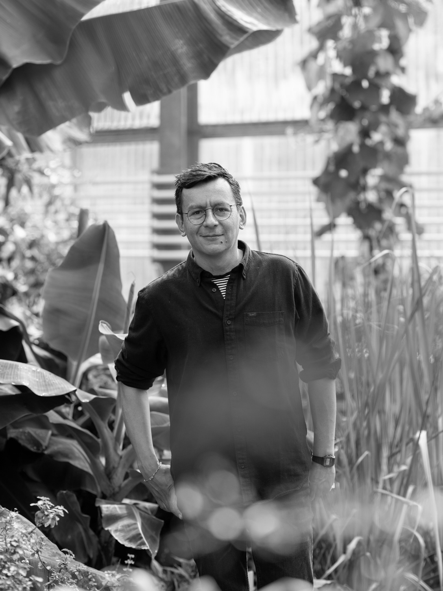

::: columns
::: {.column width="40%"}

{.profile-pic}
**Leonardo Ramirez-Lopez** *(Leo)*  
Head of Data Science  
BUCHI Labortechnik AG  
Switzerland  
```{=html}
<div class="profile-links">
  <a href="mailto:ramirez-lopez.l@buchi.com">
    <i class="bi bi-envelope"></i> email
  </a>

  <a href="https://github.com/l-ramirez-lopez"
     target="_blank" rel="noopener">
    <i class="bi bi-github"></i> GitHub
  </a>

  <a href="https://linkedin.com/in/leo-ramirez-lopez"
     target="_blank" rel="noopener">
    <i class="bi bi-linkedin"></i> LinkedIn
  </a>

  <a href="https://orcid.org/0000-0002-5369-5120"
     rel="me noopener noreferrer"
     target="_blank">
    
    ORCID
  </a>
  
  <a href="https://scholar.google.com/citations?user=KOFQEEkAAAAJ&hl=en"
     target="_blank" rel="noopener">
    <i class="bi bi-mortarboard"></i> Google Scholar
  </a>

</div>


:::

::: {.column width="60%"}


My work sits at the interface of spectroscopy, chemometrics, and applied machine learning, spanning data science and artificial intelligence across research and development, digital products, and business transformation.

I currently lead the Data Science department at [BUCHI Labortechnik AG](https://www.buchi.com/en), where I work on machine-learning platforms, embedded AI systems, and analytics services for laboratory automation and industrial applications.

My background spans applied machine learning, chemometrics, spectroscopy, and environmental modelling, with experience in both academic and industrial settings. I completed my doctoral studies at University of Tübingen (Germany), carried out postdoctoral research at ETH (Switzerland), and more recently [undertook further study at Imperial College London](https://www.imperial.ac.uk/business-school/blogs/student-blog/why-imperial-business-school-the-right-place-scientists-learn-business/)  (UK), completing a Master’s in Business Analytics. I have also lived and worked in several countries, including Colombia, Brazil, Germany, Belgium, and Switzerland.

Have a look at this post, where I discuss [why business education is important for scientists](https://www.imperial.ac.uk/business-school/blogs/student-blog/why-imperial-business-school-the-right-place-scientists-learn-business/). 


:::
:::